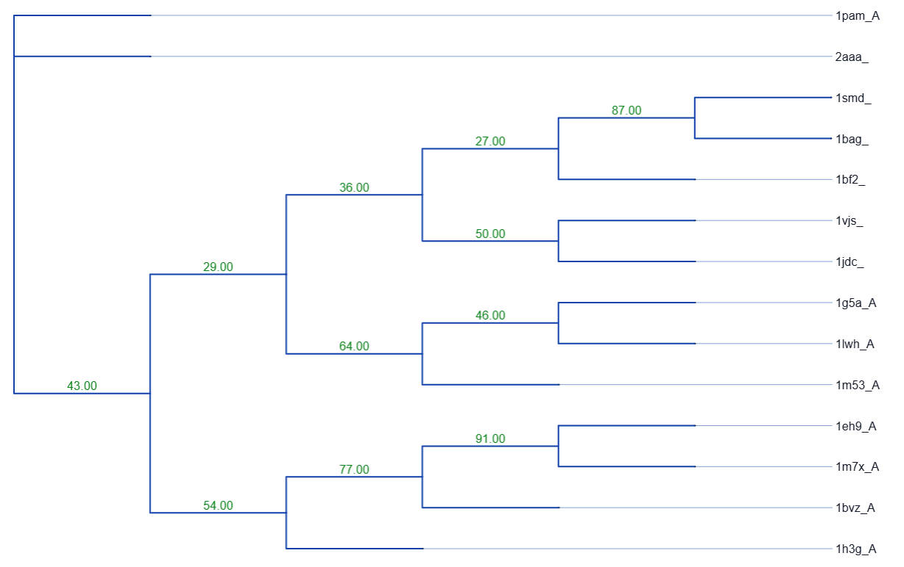
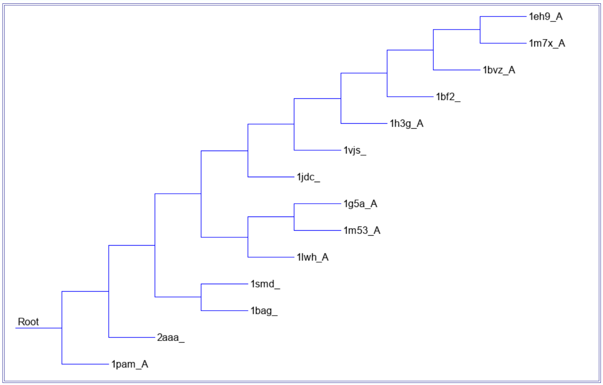
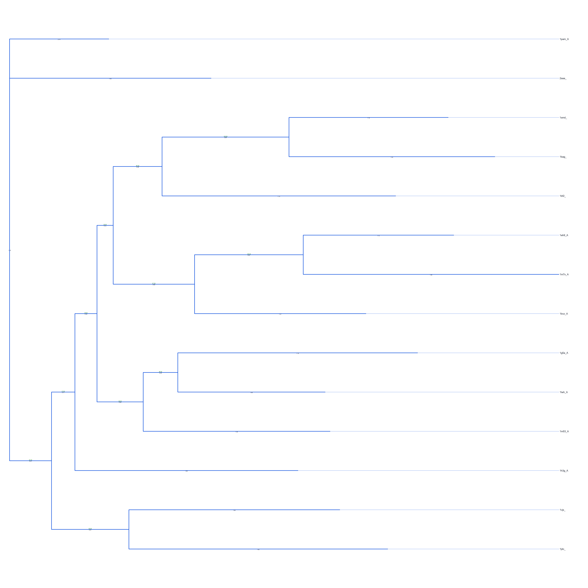
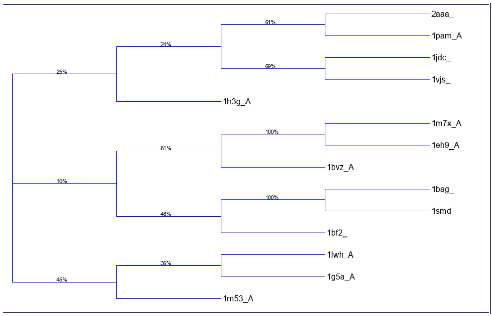
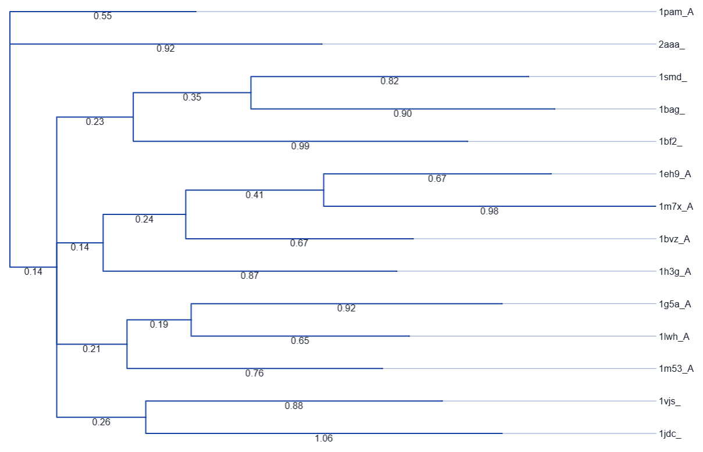
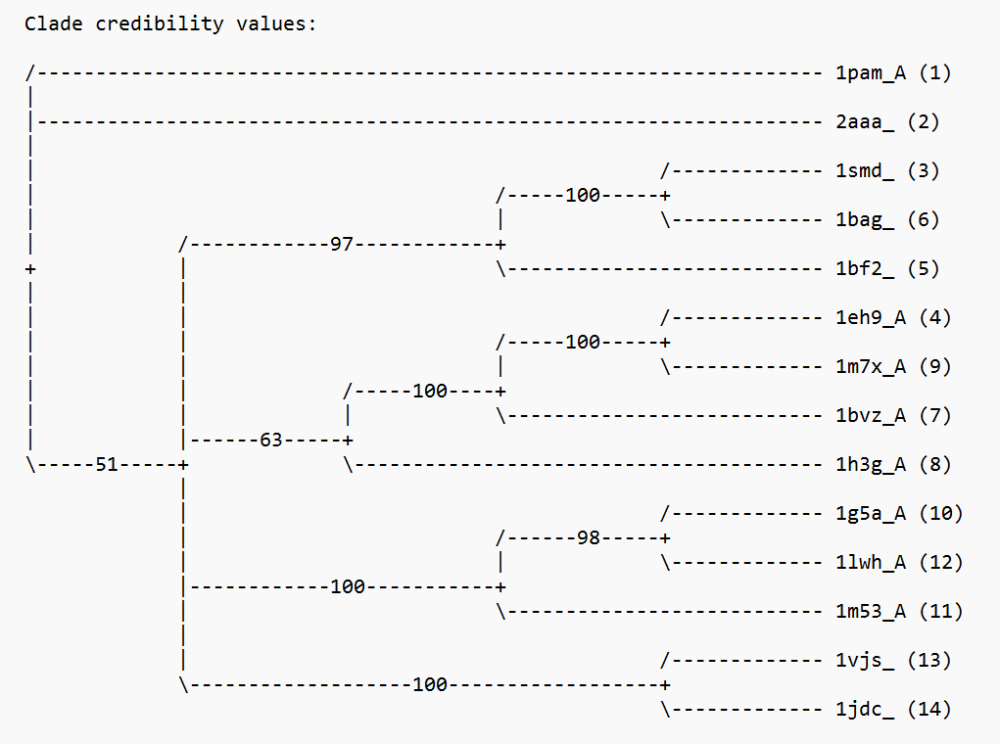

\newpage

# Résumé

Cet article porte sur la création d'un site web d'inférence d'arbres phylogénétiques, nommé **Phylodendron.rocks**. Il couvre les divers outils implémentés pour l'alignement, l'inférence phylogénétique et plus encore (conversion de fichiers, visualisation d'arbres). Les raisons pour lesquelles les outils spécifiques ont été sélectionnés ainsi que des tests pour confirmer ces choix sont présentés. Le but ultime de ce projet est de faciliter l'analyse phylogénétique pour les utilisateurs, leur offrant un grand éventail de possibilités pour répondre à leurs besoins spécifiques. Sur le plan personnel, ce projet nous a permis de nous familiariser avec plusieurs langages de programmation, et d'appliquer les connaissances acquises durant le cours BIF7101.

# Introduction et problématique 

L'inférence phylogénétique permet d'étudier les relations évolutives entre les organismes vivants en construisant des arbres à partir de données observées, telles que des séquences d'ADN ou de protéines. Il existe diverses méthodes pour l'inférence, telles que des méthodes de distance, de parcimonie et probabilistes [@phylo]. Un obstacle à ce domaine d'étude est le fait de devoir télécharger de nombreux algorithmes avant l'étape de l'analyse. Cela peut grandement ralentir une étude lorsque nous ne sommes pas familier avec l'informatique. C'est pourquoi il existe des sites webs d'inférence d'arbres phylogénétiques. Cependant, nous avons constaté que la plateforme T-REX, créé par Alix Boc, Alpha Boubacar Diallo et Vladimir Makarenkov, qui détermine l'inférence, la validation et la visualisation d'arbres et de réseaux phylogénétiques [@trex], n’est plus maintenue. En effet, plusieurs méthodes utilisées ont connu des mises à jour qui n’ont pas été reflétées sur le serveur web.  

## Les objectifs 

L'objectif principal de ce projet est d'offir aux utilisateurs des outils qui sont à jour et qui ne sont pas disponibles sur T-REX afin qu'ils puissent recevoir de meilleurs résultats, et ce, souvent plus rapidement. Certes, les anciennes versions peuvent encore fonctionner, mais n'offrent pas le meilleur potentiel aux données. 
  
Un second objectif est de créer un site web intuitif et facile d'utilisation. Nous voulons que les utilisateurs puissent télécharger les fichiers produits par les outils d'inférence au besoin et de pouvoir visualiser leurs arbres de diverses manières en leur permettant de changer les paramètres désirés.

# Méthodes et matériel 

## Les algorithmes, outils et logiciels 

### Informatique

Nous avons utilisé [**Git**](https://git-scm.com) pour le contrôle de version et le développement collaboratif. Notre *repository* est hébergé sur [GitHub](https://github.com/chelseabaek/BIF7101-projet). 

**Développement backend :**

- **Langage** : Nous avons choisi de développer le site Web en Python parce que nous voulions utiliser la bibliothèque [BioPython](https://biopython.org) [@biopython]. BioPython est un ensemble d'outils de biologie computationnelle et de bioinformatique.

- **Framework** : Pour le *framework*, nous avons utilisé **[Flask](https://flask.palletsprojects.com/en/stable/)** pour implémenter la gestion des requêtes et des réponses HTTP.


**Développement frontend :**

Pour développer l'interface utilisateur, nous avons utilisé les trois langages de base:

- **HTML** : Fournit la base structurelle de l'interface web.

- **CSS** : Définit le style visuel et la présentation de l'application.

- **JavaScript** : Permet de rendre le site dynamique et interactif.

De plus, nous avons essayé de respecter les normes d'accessibilité web afin de garantir que la plateforme soit accessible au plus grand nombre. Nous avons utilisé le [WebAIM Contrast Checker](https://webaim.org/resources/contrastchecker) pour vérifier que les rapports de contraste *text-to-background* et la taille de la police respectent ou dépassent les normes de WebAIM.

**Déploiement : **

- **Configuration de l'environnement :**
  - **Docker :**  Un Dockerfile garantit que toutes les dépendances requises sont installées et configurées de la même manière à chaque exécution, ce qui facilite le déploiement du projet et assure que l’application fonctionne de manière fiable dans n’importe quel environnement, que ce soit en local ou sur un serveur. Notre Dockerfile construit un *container* basé sur Python 3.13, installe et configure les dépendances (MAFFT, Clustal Omega, MrBayes, MUSCLE, IQ-TREE et MPBoot, ainsi que le fichier requirements.txt), puis lance l’application à l’aide de Gunicorn sur le port 8080.

  - **requirements.txt :** contient tous les packages Python nécessaires au projet (`flask`, `gunicorn`, `biopython`, `matplotlib`).

- **Hosting** : Nous hébergeons notre site pour le rendre accessible aux utilisateurs d’Internet. Notre site Web est hébergé sur [DigitalOcean](https://www.digitalocean.com). Nous avons enregistré notre nom de domaine via [Name.com](https://www.name.com) et choisi DigitalOcean pour l'hébergement, en profitant du [GitHub Student Developer Pack](https://education.github.com/pack), qui nous offrait un nom de domaine gratuit pendant un an et 200 $ de crédits DigitalOcean.


### Phylogénétique
Nous nous sommes concentrés sur la mise à jour des outils actuellement proposés par T-REX en intégrant des alternatives plus récentes et en ajoutant une méthode bayésienne pour l'inférence d'arbres.


**Inférence d'arbre :** 

Après chaque méthode d'inférence d'arbre, une visualisation de l'arbre est automatiquement générée pour l'utilisateur. Afin d'offrir une expérience plus interactive, nous avons exploré des outils autres que `Phylo.draw()` et `Phylo.draw_ascii()` de BioPython. Pour ce faire, nous avons implémenté [Phylocanvas.gl](https://www.phylocanvas.gl) [@phylocanvas], car il propose des fonctionnalités interactives permettant aux utilisateurs d'explorer et de manipuler les arbres phylogénétiques. En plus d'offrir des options similaires à T-REX, notre implémentation permet également d'ajouter des légendes de figures, de appliquer une représentation circulaire de l’arbre et de télécharger celui-ci (Figure \@ref(fig:options)).

```{r options, echo=FALSE, out.width="60%", fig.align="center", fig.cap="Options PhyloDendron.rocks (gauche) ; Options T-REX (droite)", fig.pos="H"}
knitr::include_graphics("images/options.png")
```


- **Inférence bayésienne :**  Pour l'inférence bayésienne, plutôt que de rechercher un seul arbre optimal, on explore la distribution postérieure des arbres, longueurs de branches et paramètres du modèle. Nous avons utilisé le logiciel MrBayes [@mrbayes] pour implementer l'inférence bayésienne en phylogénétique. MrBayes utilise des méthodes de MCMC (Markov Chain Monte Carlo) pour approximer cette distribution a posteriori et estimer les phylogénies et les temps de divergence des espèces [@bayesianInference]. Pour construire un arbre de consensus par inférence bayésienne sur notre site Web, l'utilisateur saisit un fichier de séquences alignées (au format FASTA ou NEXUS) ainsi que les paramètres (number of generations, sample frequency, print frequency et number of burn-ins). Si l'utilisateur entre un fichier FASTA, il est automatiquement converti au format NEXUS. Les paramètres par défaut sont également disponibles (Figure \@ref(fig:bayes)). Une fois l'analyse terminée, les arbres de consensus obtenus et les résultats sont compilés dans un fichier ZIP téléchargeable.

```{r bayes, echo=FALSE, out.width="75%", fig.align="center", fig.cap="Paramètres d'inférence bayésienne",fig.pos="H"}
knitr::include_graphics("images/pd_bayesian_inf.png")
```

- **Parcimonie : ** Pour l'inférence par méthode de parcimonie, nous avons décidé d'implémenter l'outil MPBoot [@mpboot] qui n'est pas disponible sur la plateforme T-rex. Ce programme permet également de faire une approximation rapide des bootstraps de parcimonie maximale (UFBoot, inspiré des méthodes similaires employées pour celles de maximum de vraisemblance). Il n'est donc pas nécessaire d'utiliser un outil supplémentaire (ex: SeqBoot) si le calcul des bootstraps est désiré. Pour l'algorithme de recherche, il utilise le réarrangement SPR et implémente le Parsimony ratchet. Cet algorithme permet de trouver les arbres phylogénétiques les plus parsimonieux en effectuant plusieurs cycles échantillonnage et de pondération des sites pour ensuite réaliser des réarrangement des branches en utilisant la méthode SPR. [@ratchet]. Sur notre plateforme, l'utilisateur télécharge ses séquences alignées en format FASTA et choisit les valeurs des paramètres suivant:  
  - Ultrafast Bootstraps: Nombre de réplications pour évaluer la robustesse des branches. Contrairement au bootstrap standard, l'UFBoot est très rapide et réduit le risque de surestimer le support des branches.
  - SPR Radius: Indique le rayon de SPR. Un rayon plus grand permet à l'algorithme de déplacer des branches plus loin dans l'arbre, ce qui augmente la possibilité de trouver un optimum global (mais augmente le temps de computation).
  - Ratchet Iterations: Nombre de cycles de *ratchet* à effectuer. Plus il y a d'itérations, plus l'algorithme a de chances de s'échapper d'un optimum local pour trouver l'arbre le plus court.
  - Ratchet %: Pourcentage de sites dont le poids est modifié à chaque itération. Cela permet de perturber les données pour explorer de nouvelles topologies d'arbres
  - Use NNI instead of SPR: Utile lorsqu'une analyse plus rapide est désirée, mais produit un résultat moins strict et minutueux que le réarrangement SPR.     
   
  Les paramètres par défaut sont aussi disponibles afin de faciliter la tâche aux utilisateurs (Figure \@ref(fig:mpboot1)). À la fin de l'analyse, plusieurs fichiers informatifs sont disponibles pour le téléchargement (Figure \@ref(fig:mpboot2)).
  
```{r mpboot1, echo=FALSE, out.width="75%", fig.align="center", fig.cap="Paramètres d'inférence par MPBoot",fig.pos="H"}
knitr::include_graphics("images/mpboot1.png")
```
```{r mpboot2, echo=FALSE, out.width="75%", fig.align="center", fig.cap="Fichiers téléchargeables disponibles",fig.pos="H"}
knitr::include_graphics("images/mpboot2.png")
```

- **Maximum de vraisemblance :** Quant à l'inférence par maximum de vraisemblance, l'outil IQTREE (v3.1.1) [@iqtree] à été utilisé (non disponible sur T-REX). Ce programme est particulièrement efficace grâce à son algorithme de recherche stochastique. Sur **PhyloDendron.rocks**, l'utilisateur peut ajuster les paramètres suivants :
  -Substitution Model : Permet de choisir le modèle d'évolution (ex: LG, JTT, WAG). Si l'utilisateur n'est pas certain, l'option MFP active ModelFinder, qui sélectionne automatiquement le meilleur modèle selon le critère BIC.
  -Ultrafast Bootstraps : Comme pour MPBoot, IQTREE permet d'obtenir rapidement le support des branches avec l'algorithme UFBoot (généralement 1000 réplications suffisent).
  -SH-aLRT Replicates : Nombre de répétitions pour le test de rapport de vraisemblance approximatif. Ce test évalue si une branche est nécessaire pour expliquer les données. Un minimum de 1000 répliquas est recommandé.

- **Méthodes de distance :** Pour la construction d'arbres par méthodes de distances, l'utilisateur saisit deux entrées : un fichier FASTA aligné et la méthode de distance, NJ ou UPGMA. Contrairement au plateforme T-REX, où le modèle de substitution est sélectionné manuellement par l'utilisateur, nous avons utilisé [IQ-TREE](https://iqtree.github.io) [@iqtree] afin de sélectionner le modèle de substitution le plus approprié en nous basant sur le critère BIC (Bayesian Information Criterion). Le mot-clé MFP (ModelFinder Plus) indique à IQ-TREE d'effectuer l'analyse en utilisant le modèle qui minimise le score BIC [[@iqtreeInfo].
  ```{python iqtree, eval=FALSE, python.reticulate = FALSE}
  cmd = ["iqtree3", "-s", filepath, "-m", "MFP", "-nt", "AUTO", 
          "-pre", output_prefix, "-redo"]
  ```
  
  La matrice de distances est générée par IQ-TREE lors de cette sélection de modèle, puis nous la convertissons au format compatible avec Biopython. Enfin, la méthode de distance choisie par l'utilisateur est appliquée à cette matrice pour construire l'arbre phylogénétique, toutes deux implémentées via [Biopython](https://biopython.org) [@biopython].


**Alignement : **

- **MUSCLE :** Nous avons implémenté la version 5 de MUSCLE. Contrairement à la version 3 utilisée sur T-REX, MUSCLE v5 intègre l'algorithme Super5, qui permet d'aligner des ensembles de données beaucoup plus vastes (jusqu'à des dizaines de milliers de séquences) avec une précision élevé et un temps de calcul réduit grâce au *multithreading* [@muscle].

- **MAFFT :** Nous avons intégré MAFFT (version 7), qui est reconnu pour sa rapidité d'exécution sur de larges jeux de données. MAFFT propose plusieurs stratégies d'alignement itératives (comme L-INS-i ou G-INS-i) qui offrent à la fois un alignement précis et rapides, surpassant souvent les performances des versions antérieures [@mafft].

- **Clustal Omega :** ClustalO utilise des HMM pour l'alignement profil-profil ce qui lui permet d'obtenir une meilleure précision, notamment pour les relations phylogénétiques éloignées. Contrairement à son prédécesseur ClustalW qui repose sur une stratégie d'alignement progressif avec pondération des séquences, ClustalO performe mieux sur de grands jeux de données. En effet, sa complexité algorithmique est de $O(n \log n)$ contre $O(n^2)$ pour ClustalW. De plus, ClustalO supporte le *multithreading*, ce qui accélère considérablement les calculs [@co]. ClustalW est obsolète (plus de support ni de mises à jour), donc l'implémentation de ClustalO sur notre plateforme garantit l'accès à des outils actuels, précis et qui bénéficient d'un soutien technique actif.


**Autre Outils :**

- **Viewer d'arbre Newick : ** Notre plateforme permet aux utilisateurs de téléverser directement un fichier au format Newick (sans avoir à refaire l'inférence) pour visualiser leur arbre. Grâce à Phylocanvas.gl, les utilisateurs peuvent modifier interactivement la mise en page (circulaire, rectangulaire, radiale) et exporter l'image en haute résolution.

- **Conversion : ** Puisque différents outils phylogénétiques exigent différents formats d'entrée (par exemple, MrBayes utilise le format NEXUS, tandis que MPBoot ou d'autres outils requièrent FASTA ou PHYLIP), nous avons développé un outil de conversion de séquences en utilisant le module `SeqIO` de Biopython. Cela élimine le besoin pour l'utilisateur d'utiliser des scripts externes avant de lancer ses analyses.


## Le protocole  
Cette section porte sur des tests effectués afin de valider l'implémentation des nouveaux outils (ClustalO, MPBoot, IQTREE et MrBayes) en les comparant avec un outil semblable disponible sur T-REX. Les tableaux et les visualisations d'arbres sont disponibles dans l'annexe.

### Jeux de données  
Afin de tester les outils, plusieurs groupes de séquences d'acides aminés de référence ont été téléchargées de la base de données BaliBASE (Benchmark Alignement dataBASE). Cette base de données est un répertoire utilisé fréquemment pour tester des outils d'alignement de séquence multiples [@balibase]. Nous allons donc l'employer d'abord pour évaluer la performance de ClustalO, et ensuite utiliser ces mêmes résultats d'alignement pour l'évaluation les autres outils phylogénétiques. Ce qui distingue principalement ce jeu de données est le fait que les séquences comportent une identité de séquence très basse (moins de \(25\%\)), offrant alors un vrai test de stress a nos outils. 

### Tester ClustalO

Pour tester la performance de ClustalO contre son prédécesseur ClustalW, nous avons voulu calculer le temps d’exécution et la qualité de l'alignement. Pour le test de vitesse, ClustalO et CLustalW ont été exécutés a 5 reprises sur 3 groupes de séquences de taille différente (261, 1044, 2088) prises de BaliBASE, et la moyenne du temps a été retenue pour chaque groupe. 

 
Pour le test de qualité de l'alignement, les alignements produits par ClustalO et ClustalW ont été appliqués sur IQTREE3 et les résultats du score de maximum de vraisemblance de l'arbre optimal généré de chacun a été comparé. Le meilleur alignement sera donc celui avec le score de maximum de vraisemblance le plus bas. 

  
### Tester MPBoot
Afin de tester la performance de MPBoot, nous avons décidé de le comparer à un des algorithmes de maximum de parcimonie disponible sur T-REX. PROTPARS de la suite Phylips a été choisi. Il est spécifiquement programmé pour l'analyse de séquence d'acides aminés. Les alignements de séquences générés par ClustalO à l'étape précédente sont repris, puis sont téléchargés dans MPBoot et PROTPARS. Notez que PROTPARS n'acceptent que les fichiers Phylips, donc nous les avons convertis à l'aide de l'outil de conversion disponible sur **Phylodendron.rocks**. Puisque ces deux algorithmes performent très rapidement (moins de 1 seconde par groupe de séquence dans notre jeu de données), seulement le score de parcimonie de chacun a été comparé.
    
      
### Tester IQTREE
      
Afin d'évaluer l'efficacité de notre implémentation de maximum de vraisemblance, nous avons comparé IQ-TREE (v3.1.1) à RAxML. Ces deux algorithmes sont reconnus pour leur puissance, mais IQ-TREE utilise une approche de recherche stochastique souvent plus efficace et plus rapide. Les alignements générés par ClustalO ont été analysés par les deux outils. Nous avons comparé le temps d'exécution ainsi que le score final de log-vraisemblance pour déterminer quel outil trouvait l'arbre optimal le plus rapidement. Afin de ne pas biaiser les résultats, les modèles LG+G ont été assignés aux deux algorithmes puisque nous avons déjà testé la puissance du paramètre ModelFinder en classe.
  
### Tester MrBayes

Afin de valider l'outil MrBayes, nous avons uniquement utilisé le jeu de données BB11018. Contrairement aux méthodes de maximum de vraisemblance, MrBayes utilise l'inférence bayésienne pour explorer l'espace des arbres via des chaînes de Markov (MCMC). Pour ce test, nous avons configuré l'analyse avec les paramètres *Fast presets* présents dans **Phylodendron.rocks**, donc un total de 100 000 générations avec une fréquence d'échantillonnage de 100. Nous avons aussi appliqué un burn-in de 250 pour éliminer les premiers arbres de la chaîne qui ne sont pas encore à l'équilibre. L'objectif était de voir si en utilisant ces réglages, MrBayes arrivait à une topologie stable et cohérente avec nos autres outils. Pour ce faire, nous avons entrepris une visualisation des arbres phylogénétiques calculés par MPBoot, IQ-TREE et MrBayes.

# Résultats et discussion 

## ClustalO  
    
**Test de vitesse :**    
      
La figure \@ref(fig:co) ci dessous démontre que, en augmentant le nombre de séquences, ClustalO performe mieux que ClustalW. En effet, sur de courtes séquences, ClustalW est plus rapide, mais il augmente de manière exponentielle en augmentant la taille du jeu de données. 
    
    
```{r co, echo=FALSE, out.width="50%", fig.align="center", fig.cap="Moyenne du temps d'execution de CLustalO et ClustalW sur 3 groupes de sequences de taille differente",fig.pos="H"}
values <- matrix(c(133, 24, 324, 293, 703, 1187), nrow = 2)
barplot(values, beside = TRUE, col = c("purple", "yellow"), names.arg = c(261,1044,2088), legend.text = c("ClustalO", "ClustalW"), xlab = "Nombre de séquences", ylab = 'Temps (s)', main="Temps d'execution de l'alignement: ClustalO vs ClustalW") 

```
  

**Test de la qualité de l'alignement :**   
    
Le tableau \@ref(tab:co-table) dans l'annexe démontre que ClustalO effectue un meilleur alignement que ClustalW selon le score de maximum de vraisemblance produit par IQTREE, échouant seulement 5 fois sur 38. D'ailleurs, le tableau \@ref(tab:bali) en annexe affiche les statistiques des séquences alignées. Nous pouvons apercevoir que ce sont les groupes de séquences moins nombreuses et courtes qui produisent un meilleur résultat. Cela correspond à la littérature [@co]. Néanmoins, ClustalO s'avère plus performant pour le traitement de jeux de données larges. Contrairement à ClustalW, qui utilise un alignement progressif classique, ClustalO repose sur des modèles de Markov cachés pour l'alignement profil-profil. Cette approche permet de garder une meilleure précision sur des séquences très divergentes, comme celles de BaliBASE où l'identité est souvent moins de 25 %. L'intégration de cet outil sur PhyloDendron.rocks assure donc une précision accrue tout en supportant le *multithreading* pour réduire les temps de calcul. 


## MPBoot

Le tableau \@ref(tab:mp-table) dans l'annexe illustre les scores de parcimonies calculés par MPBoot et PROTPARS. Nous avons pu démontrer que MPBoot trouvait pour chaque groupe un meilleur arbre consensus. Cette différence de performance est expliqué par le fait que PROTPARS est un outil plus ancien qui utilise une méthode de parcimonie d'Eck et Dayoff (parcimonie des protéines) dont les algorithmes de recherche sont moins exhaustifs. De plus, PROTPARS ne possède pas de fonction de bootstrapping intégrée, ce qui oblige l'utilisateur à passer par des étapes supplémentaires et souvent plus lentes (comme l'utilisation de SeqBoot) pour évaluer la robustesse de l'arbre. En revanche, MPBoot permet de réaliser des analyses de parcimonie beaucoup plus poussées en intégrant directement le bootstrapping ultra-rapide (UFBoot). L'adoption de cet outil sur PhyloDendron.rocks permet donc de contrer les manques de T-REX en offrant une solution plus précise et plus flexible pour l'inférence par parcimonie. 


## IQTREE

Le tableau \@ref(tab:iq-table) dans l'annexe démontre les scores de log-vraisemblance et le temps d’exécution des deux algorithmes. Nous pouvons constater que les scores sont très similaires, démontrant que les deux outils arrivent à la même qualité d'arbre pour ces jeux de données. Cependant, la différence se joue au niveau du temps de calcul. Bien que RAxML s'est démontré plus rapide 17 fois sur 38, ce n'est seulement que pour une trentaine de secondes. En effet, le temps le plus long n'était que de 66 secondes pour le jeu BB11018, alors que cela a pris 1122 secondes à RAxML. Cette rapidité s'explique par son algorithme de recherche stochastique qui explore l'espace des arbres de manière plus optimale en évitant les calculs redondants sans sacrifier la précision du score de log-vraisemblance. En intégrant IQ-TREE dans **PhyloDendron.rocks**, nous offrons donc une solution qui maintient la rigueur de la méthode de maximum de vraisemblance tout en minimisant l'attente pour l'utilisateur, ce qui est crucial pour une plateforme web.


## MrBayes

Même avec un nombre de générations relativement court (100 000), la topologie de l'arbre obtenue à l'aide de MrBayes (voir Figure \@ref(fig:mrbayes-tree)) est identique à celle d'IQ-TREE (Figure \@ref(fig:iqtree-tree)) et de MPBoot (Figure \@ref(fig:mpboot-tree)). Les probabilités postérieures sont très élevées (Figure \@ref(fig:clade)), montrant que la chaîne a bien convergé vers une solution fiable. Malheureusement, nous n'avons pas encore implémenté la visualisation des probabilités à posteriori sur notre interface. Par contre, notons que MrBayes est beaucoup plus lent. En effet, pour le même dataset, il prend plusieurs minutes là où IQ-TREE finit en quelques secondes. C'est pour cette raison que nous avons intégré des des paramètres manuels dans l'interface de **PhyloDendron.rocks**. Cela permet à l'utilisateur de choisir rapidement entre une analyse rapide ou une exploration plus poussée.


# Conclusion 

L’objectif principal de ce projet était de fournir aux utilisateurs une plateforme Web moderne pour l’inférence phylogénétique, intégrant des outils récents non disponibles sur la plateforme T-REX, tout en améliorant la facilité d’utilisation.

L’utilisabilité est améliorée grâce à l’intégration de paramètres prédéfinis suggérés. De plus, les arbres inférés sont automatiquement générés et affichés à la fin de chaque analyse, donc aucun outil supplémentaire n'est nécessaire pour visualiser l'arbre.

PhyloDendron.rocks constitue une extension de T-REX dans plusieurs domaines (résumé dans la table \@ref(tab:summary)). Pour l'inférence d'arbres phylogénétiques, l'intégration d'IQ-TREE, MPBoot et MrBayes permet aux utilisateurs d'accéder à ces méthodes (non disponibles sur T-REX). Pour l'alignement de séquences, des outils tels que MUSCLE, MAFFT et ClustalO offrent des alignements plus rapides et plus précis que les versions précédentes, notamment pour les grands ensembles de données. Enfin, nous permettons aux utilisateurs de télécharger des fichiers Newick pour la visualisation et de convertir des fichiers.

Des améliorations peuvent être apportées pour optimiser la portée et les performances de PhyloDendron.rocks. Il existe de nombreux autres outils phylogénétiques qui vont au-delà de ceux que nous avons implémentés et de ceux disponibles sur T-REX. Par exemple, nous pourrions ajouter un outil d'inférence bayésienne, tel que BEAST, qui estime les dates de divergence entre espèces à partir de séquences et de calibrations fossiles ou biogéographiques.

Une autre amélioration concerne le logiciel. Nous pourrions implémenter une exécution asynchrone pour les analyses nécessitant une puissance de calcul importante, telles que MrBayes, ce qui permettrait aux utilisateurs de continuer à utiliser la plateforme pendant que les calculs sont en cours.


\renewcommand{\arraystretch}{1.75}

```{r summary, echo=FALSE, warning=FALSE, fig.cap="Summary", fig.pos="H"}

library(knitr)
library(kableExtra)
library(dplyr)

data <- data.frame(
  Catégorie = c(
    "Inférence d’arbre","Inférence d’arbre","Inférence d’arbre","Inférence d’arbre",
    "Alignement","Alignement","Alignement",
    "Autres outils","Autres outils"
  ),
  Méthode = c(
    "Inférence bayésienne",
    "Parcimonie",
    "Maximum de vraisemblance",
    "Méthodes de distance",
    "MUSCLE",
    "MAFFT",
    "Clustal",
    "Viewer d’arbre Newick",
    "Conversion"
  ),
  PhyloDendron = c(
    "Utilise MrBayes pour estimer les phylogénies des espèces et les temps de divergence",
    "MPBoot ; Inclut l'algorithme UFBoot et accepte les séquences d'ADN et de protéines.",
    "IQTREE ;",
    "Choisit automatiquement le meilleur modèle de substitution selon le BIC",
    "MUSCLE v5 ; plus précis et plus rapide (utilise multithreading) que v3",
    "MAFFT v7",
    "ClustalO ; plus rapide pour les séquences plus longues",
    "Plus d'options pour manipuler l'arbre que T-REX",
    "Conversion entre différents types de fichiers"
  ),
  TREX = c(
    "Pas disponible",
    "PROTPARS ; Prend uniquement des séquences d'acides aminés et n'a pas d'option de bootstrap intégré.",
    "RAxML ; Méthode classique performante, mais souvent plus lente sur les gros jeux de données",
    "Les utilisateurs saisissent leur choix de modèle de substitution",
    "MUSCLE v3",
    "MAFFT v6",
    "ClustalW ; plus rapide pour les séquences plus courtes",
    "Options pour manipuler l'arbre",
    "Pas disponible"
  ),
  stringsAsFactors = FALSE
)


kable(data, format = "latex", escape = FALSE, align = "c", caption = "Résumé des outils utilisés \\label{tab:summary}", float = TRUE) %>%
  kable_styling(
    latex_options = c("HOLD_position"),
    position = "center"
  ) %>%
  column_spec(1, bold = TRUE) %>% 
  column_spec(2, width = "3.25cm") %>%
  column_spec(3, width = "4.25cm") %>%
  column_spec(4, width = "4.25cm") %>%
  collapse_rows(columns = 1, latex_hline = "full") %>%
  row_spec(0, bold = TRUE, font_size = 12) 
```


\newpage


# Références 

<!-- Chaque référence doit être citée au moins une fois dans le texte  -->

::: {#refs}
:::

\newpage
\appendix

\renewcommand{\arraystretch}{1}

# Annexe

## Tables: ClustalO vs ClustalW

```{r message=FALSE, warning=FALSE, include=FALSE}
library(knitr)
library(kableExtra)
library(dplyr)
```


```{r bali, echo=FALSE, message=FALSE, warning=FALSE}
data <- read.csv('tables/balibase_summary.csv')
data$Dataset.ClustalO <- gsub("_", "\\\\_", data$Dataset.ClustalO)
data$Dataset.ClustalW <- gsub("_", "\\\\_", data$Dataset.ClustalW)
data %>%
  kbl(booktabs = TRUE, 
      format = "latex", 
      caption = "Statisques des alignements de séquences produits par ClustalO et ClustalW",
      col.names = c("DataSet ClustalO", "Nbr de seq", "Longueur", "$\\%$ Identité", "DataSet ClustalW", "Nbr de seq", "Longueur", "$\\%$ Identité"),
      escape = FALSE) %>%
  kable_styling(latex_options = c("HOLD_position")) %>%
  column_spec(1:4, background = "#D0E4FF") %>% 
  column_spec(5:8, background = "#D4EDDA")
```
  

```{r co-table, echo=FALSE, message=FALSE, warning=FALSE}
data <- read.csv('tables/co_vs_cw.csv')

data %>%
  kbl(booktabs = TRUE, 
      format = "latex", 
      caption = "Log-Likelihood Comparison: ClustalO vs ClustalW",
      col.names = c("DataSet", "LogL ClustalO", "LogL ClustalW", "Difference $\\Delta \\ln L$"),
      escape = FALSE) %>%
  kable_styling(latex_options = c("HOLD_position")) %>%
  column_spec(4, 
              background = ifelse(data$Difference.DlnL < 0, "#FFCCCC", "#CCFFCC"),
              color = "black")
```


## Tables et figures: MPBoot vs PROTPARS

### Table: MPBoot vs PROTPARS


```{r mp-table, echo=FALSE}
data2 <- read.csv('tables/mpboot_vs_protpars.csv')

data2 %>%
  kbl(booktabs = TRUE, 
      format = "latex", 
      caption = "Parsimony Score Comparison: MPBoot vs PROTPARS",
      col.names = c("DataSet", "MPBoot score", "PROTPARS score", "Difference $\\Delta$ Score"),
      escape = FALSE) %>% 
  kable_styling(latex_options = c("HOLD_position")) %>%
  column_spec(4, 
              background = ifelse(data2$Difference.Parsimony.score < 0, "#FFCCCC", "#CCFFCC"),
              color = "black")
```


### Arbres concensus MPBoot vs PROTPARS


```{r mpboot-tree, echo=FALSE, out.width="75%", fig.align="center", fig.cap="Arbre consensus MPBoot du jeu de données BB11018 - Visualisation via Phylodendron.rocks",fig.pos="H"}

```


```{r protpars-tree, echo=FALSE, out.width="75%", fig.align="center", fig.cap="Arbre consensus PROTPARS du jeu de données BB11018 - Visualisation via T-REX",fig.pos="H"}

```

## Tables et figures: IQTREE vs RAxML

### Table: IQTREE vs RAxML

```{r iq-table, echo=FALSE}
data3 <- read.csv('tables/iqtree_vs_raxml.csv')

data3 %>%
  kbl(booktabs = TRUE, 
      format = "latex", 
      caption = "LogL Score and Time Comparison: IQTREE vs RAxML",
      col.names = c("DataSet", "IQTREE LogL", "RAxML LogL", 'IQTREE Time', 'RAxML Time', "Difference $\\Delta$ Time"),
      escape = FALSE) %>% 
  kable_styling(latex_options = c("HOLD_position")) %>%
  column_spec(6, 
              background = ifelse(data3$Time.Difference < 0, "#FFCCCC", "#CCFFCC"),
              color = "black")
```


### Arbres concensus IQTREE vs RAxML


```{r iqtree-tree, echo=FALSE, out.width="75%", fig.align="center", fig.cap="Arbre consensus IQTREE du jeu de données BB11018 - Visualisation via Phylodendron.rocks",fig.pos="H"}

```


```{r raxml-tree, echo=FALSE, out.width="75%", fig.align="center", fig.cap="Arbre consensus RAxML du jeu de données BB11018 - Visualisation via T-REX",fig.pos="H"}

```


## Figures: MrBayes

### Arbres consensus MrBayes

```{r mrbayes-tree, echo=FALSE, out.width="75%", fig.align="center", fig.cap="Arbre consensus MrBayes du jeu de données BB11018 - Visualisation via Phylodendron.rocks",fig.pos="H"}

```

```{r clade, echo=FALSE, out.width="75%", fig.align="center", fig.cap="Arbre consensus MrBayes du jeu de données BB11018 avec les probabilités à posteriori",fig.pos="H"}

```

---
nocite: '@*'
...