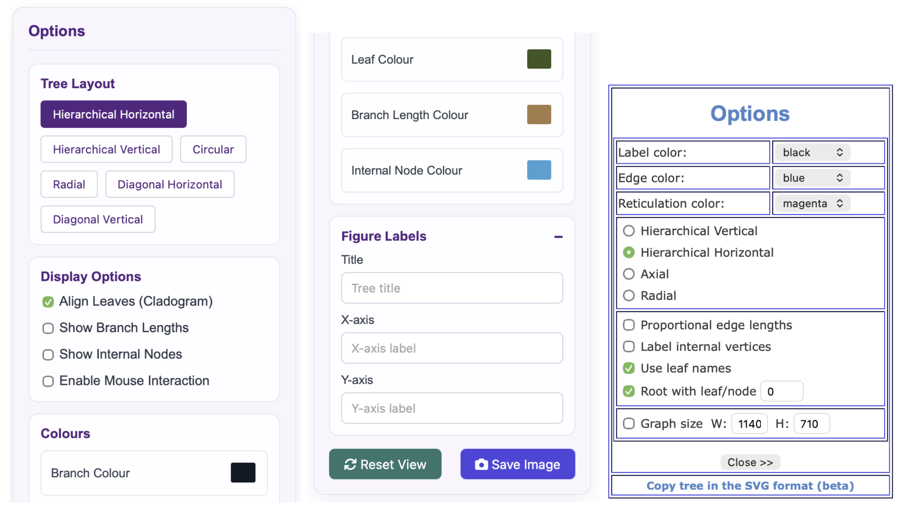
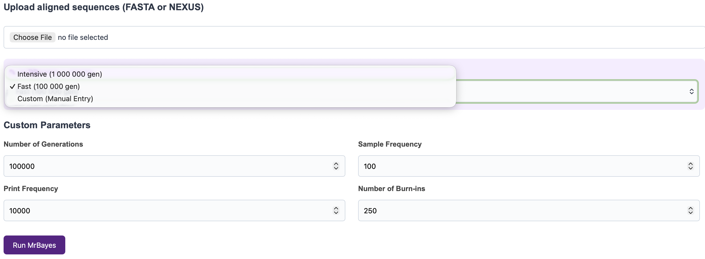
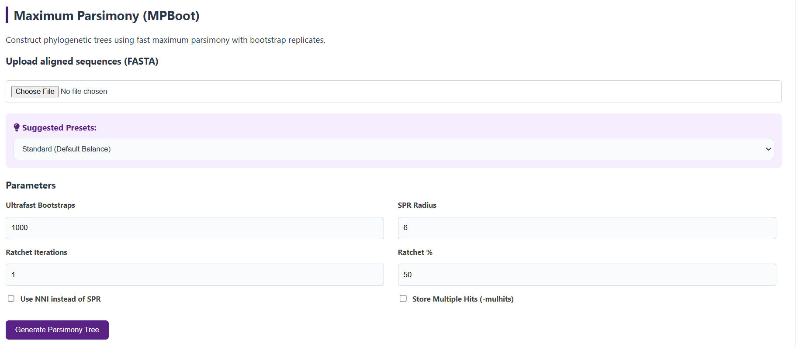

\newpage

# Résumé

Cet article porte sur la création d'un site web d'inférence d'arbres phylogénétiques, nommé [**Phylodendron.rocks**](https://phylodendron.rocks). Il couvre les divers outils implémentés pour l'alignement, l'inférence phylogénétique et plus encore (conversion de fichiers, visualisation d'arbres). Les raisons pour lesquelles les outils spécifiques ont été sélectionnés ainsi que des tests pour confirmer ces choix sont présentés. Ce projet a été motivé par le constat que le site [**T-REX**](https://www.trex.uqam.ca), recommandé aux étudiants en bioinformatique de l'UQAM pour la réalisation d'analyses phylogénétiques, n'était pas à jour avec les outils les plus récents.

Nous avons implémenté des versions plus récentes de certains outils disponibles sur T-REX, ainsi que des outils supplémentaires qui n'étaient pas inclus. Les performances des outils que nous avons implémentés ont été évaluées à l'aide de jeux de données de référence (BaliBASE) et comparées à celles des outils utilisés sur T-REX. Les résultats montrent une précision et une efficacité de calcul (computational efficiency?) améliorées. 

Le but ultime de ce projet est de faciliter l'analyse phylogénétique pour les utilisateurs, leur offrant un grand éventail de possibilités pour répondre à leurs besoins spécifiques. Sur le plan personnel, ce projet nous a permis de nous familiariser avec plusieurs langages de programmation, et d'appliquer les connaissances acquises durant le cours BIF-7101.

# Introduction et problématique 

L'inférence phylogénétique permet d'étudier les relations évolutives entre les organismes vivants en construisant des arbres à partir de données observées, telles que des séquences d'ADN ou de protéines. Il existe diverses méthodes pour l'inférence, telles que des méthodes de distance, de parcimonie et probabilistes. Un obstacle à ce domaine d'étude est le fait de devoir télécharger de nombreux algorithmes avant l'étape de l'analyse. Cela peut grandement ralentir une étude lorsque nous ne sommes pas familiers avec l'informatique. C'est pourquoi il existe des sites web d'inférence d'arbres phylogénétiques. Cependant, nous avons constaté que la plateforme T-REX, créée par Alix Boc, Alpha Boubacar Diallo et Vladimir Makarenkov, qui déterminent l'inférence, la validation et la visualisation d'arbres et de réseaux phylogénétiques [@trex], n’est plus maintenue. En effet, plusieurs méthodes utilisées ont connu des mises à jour qui n’ont pas été reflétées sur le serveur web. Ce projet est motivé par la nécessité de fournir aux utilisateurs effectuant des analyses phylogénétiques un accès facile aux outils les plus récents. 

Notre objectif est de répondre à la problématique principale : Quelles méthodes phylogénétiques et quels outils informatiques peuvent être intégrés à une plateforme Web pour améliorer encore l'efficacité et l'utilisabilité des analyses phylogénétiques ?

Dans cette optique, l'objectif principal de ce projet est d'offrir aux utilisateurs des outils qui sont à jour et qui ne sont pas disponibles sur T-REX afin qu'ils puissent recevoir de meilleurs résultats, et ce, souvent plus rapidement. Certes, les anciennes versions peuvent encore fonctionner, mais n'offrent pas le meilleur potentiel aux données. Un second objectif est de créer un site web intuitif et facile d'utilisation. Nous voulons que les utilisateurs puissent télécharger les fichiers produits par les outils d'inférence au besoin et de pouvoir visualiser leurs arbres de diverses manières en leur permettant de changer les paramètres désirés. Ce projet est une extension de T-REX et a été développé en référence à «T-REX: a web server for inferring, validating and visualizing phylogenetic trees and networks» [@trex].

# Méthodes et matériel 

## Les algorithmes, outils et logiciels 

### Informatique

Nous avons utilisé [**Git**](https://git-scm.com) pour le contrôle de version et le développement collaboratif. Notre *repository* est hébergé sur [GitHub](https://github.com/chelseabaek/BIF7101-projet). 

**Développement backend :**

- **Langage** : Nous avons choisi de développer le site Web en Python parce que nous voulions utiliser la bibliothèque [BioPython](https://biopython.org) [@biopython]. BioPython est un ensemble d’outils de biologie computationnelle et de bioinformatique que nous avons utilisés pour manipuler des fichiers de séquences, lire et valider des arbres de Newick et convertir des données entre différents formats.

- **Framework** : Pour le *framework*, nous avons utilisé **[Flask](https://flask.palletsprojects.com/en/stable/)** pour implémenter la gestion des requêtes et des réponses HTTP, organiser les routes du site et connecter le *frontend* du site aux différentes fonctions *backend*.


**Développement frontend :**

Pour développer l'interface utilisateur, nous avons utilisé les trois langages de base:

- **HTML** : Fournit la base structurelle de l'interface web.

- **CSS** : Définit le style visuel et la présentation de l'application.

- **JavaScript** : Permet de rendre le site dynamique et interactif.

De plus, nous avons essayé de respecter les normes d'accessibilité web afin de garantir que la plateforme soit accessible au plus grand nombre. Nous avons utilisé le [WebAIM Contrast Checker](https://webaim.org/resources/contrastchecker) pour vérifier que les rapports de contraste *text-to-background* et la taille de la police respectent ou dépassent les normes de WebAIM.

**Déploiement : **

- **Configuration de l'environnement :**
  - **Docker :**  Un Dockerfile garantit que toutes les dépendances requises sont installées et configurées de la même manière à chaque exécution, ce qui facilite le déploiement du projet et assure que l’application fonctionne de manière fiable dans n’importe quel environnement, que ce soit en local ou sur un serveur. Notre Dockerfile construit un *container* basé sur Python 3.13, installe et configure les dépendances (MAFFT, Clustal Omega, MrBayes, MUSCLE, IQ-TREE et MPBoot, ainsi que le fichier requirements.txt), puis lance l’application à l’aide de Gunicorn sur le port 8080.

  - **requirements.txt :** Ce fichier contient tous les *packages* Python nécessaires au projet (`flask`, `gunicorn`, `biopython`, `matplotlib`).

- **Hosting** : Nous hébergeons notre site pour le rendre accessible aux utilisateurs d’Internet. Notre site Web est hébergé sur [DigitalOcean](https://www.digitalocean.com). Nous avons enregistré notre nom de domaine via [Name.com](https://www.name.com) et choisi DigitalOcean pour l'hébergement, en profitant du [GitHub Student Developer Pack](https://education.github.com/pack), qui nous offrait un nom de domaine gratuit pendant un an et 200 $ de crédits DigitalOcean.


### Phylogénétique
Nous nous sommes concentrés sur la mise à jour des outils actuellement proposés par T-REX en intégrant des alternatives plus récentes et en ajoutant une méthode bayésienne pour l'inférence d'arbres.


**Inférence d'arbre :** 

Après chaque méthode d'inférence d'arbre, une visualisation de l'arbre est automatiquement générée pour l'utilisateur. Afin d'offrir une expérience plus interactive, nous avons exploré des outils autres que `Phylo.draw()` et `Phylo.draw_ascii()` de BioPython. Pour ce faire, nous avons implémenté [Phylocanvas.gl](https://www.phylocanvas.gl) [@phylocanvas], car il propose des fonctionnalités interactives permettant aux utilisateurs d'explorer et de manipuler les arbres phylogénétiques. En plus d'offrir des options similaires à T-REX, notre implémentation permet également d'ajouter des légendes de figures, d'appliquer une représentation circulaire de l’arbre et de télécharger celui-ci (Figure \@ref(fig:options)).

```{r options, echo=FALSE, out.width="60%", fig.align="center", fig.cap="Options PhyloDendron.rocks (gauche) ; Options T-REX (droite)", fig.pos="H"}

```


- **Inférence bayésienne :**  Pour l'inférence bayésienne, plutôt que de rechercher un seul arbre optimal, on explore la distribution postérieure des arbres, longueurs de branches et paramètres du modèle. Nous avons utilisé le logiciel MrBayes [@mrbayes] pour implémenter l'inférence bayésienne en phylogénétique. MrBayes utilise des méthodes de MCMC (Markov Chain Monte Carlo) pour approximer cette distribution a posteriori et estimer les phylogénies et les temps de divergence des espèces [@bayesianInference]. Pour construire un arbre de consensus par inférence bayésienne sur notre site Web, l'utilisateur saisit un fichier de séquences alignées (au format FASTA ou NEXUS) ainsi que les paramètres (number of generations, sample frequency, print frequency et number of burn-ins). Si l'utilisateur entre un fichier FASTA, il est automatiquement converti au format NEXUS. Les paramètres par défaut sont également disponibles (Figure \@ref(fig:bayes)). Une fois l'analyse terminée, les arbres de consensus obtenus et les résultats sont compilés dans un fichier ZIP téléchargeable.

```{r bayes, echo=FALSE, out.width="65%", fig.align="center", fig.cap="Paramètres d'inférence bayésienne",fig.pos="H"}

```

- **Parcimonie : ** Pour l'inférence par méthode de parcimonie, nous avons décidé d'implémenter l'outil MPBoot [@mpboot] qui n'est pas disponible sur la plateforme T-REX. Ce programme permet également de faire une approximation rapide des bootstraps de parcimonie maximale (UFBoot, inspiré des méthodes similaires employées pour celles de maximum de vraisemblance). Il n'est donc pas nécessaire d'utiliser un outil supplémentaire (ex. SeqBoot) si le calcul des bootstraps est désiré. Pour l'algorithme de recherche, il utilise le réarrangement SPR et implémente le `Parsimony ratchet`. Cet algorithme permet de trouver les arbres phylogénétiques les plus parcimonieux en effectuant plusieurs cycles d'échantillonnage et de pondération des sites pour ensuite  réaliser des réarrangements des branches en utilisant la méthode SPR. [@ratchet]. Sur notre plateforme, l'utilisateur télécharge ses séquences alignées en format FASTA et choisit les valeurs des paramètres suivant:  
  - Ultrafast Bootstraps:
  - SPR Radius: Indique le rayon de SPR. Un rayon plus grand permet à l'algorithme de déplacer des branches plus loin dans l'arbre, ce qui augmente la possibilité de trouver un optimum global (mais augmente le temps de computation).
  - Ratchet Iterations:
  - Ratchet %:
  - Use NNI instead of SPR: Utile lorsqu'une analyse plus rapide est désirée, mais produit un résultat moins strict et minutieux.     
   
  Les paramètres par défaut sont aussi disponibles afin de faciliter la tâche aux utilisateurs (Figure \@ref(fig:mpboot1)). À la fin de l'analyse, plusieurs fichiers informatifs sont disponibles pour le téléchargement (Figure \@ref(fig:mpboot2)).
  
```{r mpboot1, echo=FALSE, out.width="75%", fig.align="center", fig.cap="Paramètres d'inférence par MPBoot",fig.pos="H"}

```
```{r mpboot2, echo=FALSE, out.width="75%", fig.align="center", fig.cap="Fichiers téléchargeables disponibles",fig.pos="H"}

```

- **Maximum de vraisemblance :** Quant à l'inférence par maximum de vraisemblance, l'outil IQTREE (v3.1.1) [@iqtree] a été utilisé (non disponible sur T-REX).

- **Méthodes de distance :** Pour la construction d'arbres par méthodes de distances, l'utilisateur saisit deux entrées : un fichier FASTA aligné et la méthode de distance, NJ ou UPGMA. Contrairement à la plateforme T-REX, où le modèle de substitution est sélectionné manuellement par l'utilisateur, nous avons utilisé [IQ-TREE](https://iqtree.github.io) [@iqtree] afin de sélectionner le modèle de substitution le plus approprié en nous basant sur le critère BIC (Bayesian Information Criterion). Le mot-clé MFP (ModelFinder Plus) indique à IQ-TREE d'effectuer l'analyse en utilisant le modèle qui minimise le score BIC [[@iqtreeInfo].

  ```{python iqtree, eval=FALSE, python.reticulate = FALSE}
  cmd = ["iqtree3", "-s", filepath, "-m", "MFP", "-nt", "AUTO", 
          "-pre", output_prefix, "-redo"]
  ```
  
  La matrice de distances est générée par IQ-TREE lors de cette sélection du modèle, puis nous la convertissons au format compatible avec Biopython. Enfin, la méthode de distance choisie par l'utilisateur est appliquée à cette matrice pour construire l'arbre phylogénétique, toutes deux implémentées via [Biopython](https://biopython.org) [@biopython].


**Alignement : **

- **MUSCLE :** 

- **MAFFT :** 

- **Clustal Omega :** ClustalO utilise des HMM pour l'alignement profil-profil ce qui lui permet d'obtenir une meilleure précision, notamment pour les relations phylogénétiques éloignées. En revanche, ClustalW, son predecesseur, utilise une stratégie d'alignement progressif avec pondération des séquences. En effet, Clustal suit O(nlogn) alors que CLustalW suit O(n^2), ce qui demontre qu'avec un plus grand nombre de sequence, ClustalO est plus rapide. ClustalO a aussi remplace completement ClustalW, ce dernier ne recevant plus de mises a jour, ni de support. *something about threads as well* Il est donc important pour nous d'implementer des outils actuels afin de non seulement augmenter la precision des resultats, mais aussi de pouvoir avoir acces a du soutien si un probleme survient.


**Autre Outils :**

- **Viewer d'arbre Newick : ** Cet outil permet aux utilisateurs de télécharger ou de coller un fichier Newick pour la visualisation. Il utilise le module `Phylo` de BioPython pour lire et valider la structure de l'arbre, puis Phylocanvas.gl pour l'afficher. Il est aussi possible d'ajouter des légendes aux figures et d'enregistrer l'arbre.

- **Conversion :** Cet outil permet la conversion entre plusieurs types de fichiers courants. Il masque également le paramètre de type de molécule lorsque le format choisi ne le requiert pas, afin de simplifier l'utilisation. Nous utilisons les modules `Phylo` et `AlignIO` de BioPython pour convertir le fichier d'entrée au format souhaité.


## Le protocole  
Cette section porte sur des tests effectués afin de valider l'implémentation des nouveaux outils (ClustalO, MPBoot, IQTREE et MrBayes) en les comparant avec un outil semblable disponible sur T-REX.  

### Jeux de données  
Afin de tester les outils, plusieurs groupes de séquences d'acides aminés de référence ont été téléchargés de la base de données BaliBASE (Benchmark Alignement dataBASE). Cette base de données est un répertoire utilise fréquemment pour tester des outils d'alignement de séquence multiple [@balibase]. Nous allons donc l'employer d'abord pour évaluer la performance de ClustalO, et ensuite utiliser ces mêmes résultats d'alignement pour l'évaluation les autres outils phylogénétiques. Ce qui distingue principalement ce jeu de données est le fait que les séquences comportent une identité de séquence très basse (moins de \(25\%\)), offrant alors un vrai test de stress à nos outils. 

### Tester ClustalO

Pour tester la performance de ClustalO contre son prédécesseur ClustalW, nous avons voulu calculer le temps d'exécution et la qualité de l'alignement. Pour le test la vitesse, ClustalO et CLustalW ont été exécutés à 5 reprises sur 3 groupes de séquences de taille différente (261, 1044, 2088) prises de BaliBASE, et la moyenne du temps a été retenue pour chaque groupe. 

 
Pour le test de qualité de l'alignement, les alignements produits par ClustalO et ClustalW ont été appliqués sur IQTREE3 et les résultats du score de maximum de vraisemblance de l'arbre optimal généré de chacun ont été comparés. Le meilleur alignement sera donc celui avec le score de maximum de vraisemblance le plus bas. 

  
### Tester MPBoot
Afin de tester la performance de MPBoot, nous avons décidé de le comparer à un des algorithmes de maximum de parcimonie disponible sur T-REX. PROTPARS de la suite Phylips a été choisie. Il est spécifiquement programmé pour l'analyse de séquence d'acides aminés. Les alignements de séquences générés par ClustalO à l'étape précédente sont repris, puis sont téléchargés dans MPBoot et PROTPARS. Notez que PROTPARS n'accepte que les fichiers Phylips, donc nous les avons convertis à l'aide de l'outil de conversion disponible sur **Phylodendron.rocks**. Puisque ces deux algorithmes performent très rapidement (moins de 1 seconde par groupe de séquence dans notre jeu de données), seul le score de parcimonie de chacun a été comparé.
    
      
### Tester IQTREE

# Résultats et discussion 

## Les résultats 

### ClustalO  
    
**Test de vitesse :**    
      
Le Figure \@ref(fig:co) ci dessous demontre que, en augmentant le nombre de sequence, ClustalO performe mieux que ClustalW.
    
    
```{r co, echo=FALSE, out.width="50%", fig.align="center", fig.cap="Moyenne du temps d'execution de CLustalO et ClustalW sur 3 groupes de sequences de taille differente",fig.pos="H"}
values <- matrix(c(133, 24, 324, 293, 703, 1187), nrow = 2)
barplot(values, beside = TRUE, col = c("purple", "yellow"), names.arg = c(261,1044,2088), legend.text = c("ClustalO", "ClustalW"), xlab = "Nombre de séquences", ylab = 'Temps (s)', main="Temps d'execution de l'alignement: ClustalO vs ClustalW") 

```
  

**Test de la qualité de l'alignement :**   
    
Le tableau ci-dessous démontre que ClustalO effectue un meilleur alignement que ClustalW, échouant seulement 4 fois sur 38. 


```{r include=FALSE}
library(knitr)
library(kableExtra)
library(dplyr)
```

  
```{r echo=FALSE, warning=FALSE, eval=FALSE}
data <- read.csv('co_vs_cw.csv')

data %>%
  kbl(booktabs = TRUE, 
      format = "latex", 
      caption = "Log-Likelihood Comparison: ClustalO vs ClustalW",
      col.names = c("DataSet", "LogL ClustalO", "LogL ClustalW", "Difference $\\Delta \\ln L$"),
      escape = FALSE) %>%
  kable_styling(latex_options = c("HOLD_position")) %>%
  column_spec(4, 
              background = ifelse(data$Difference.DlnL < 0, "#FFCCCC", "#CCFFCC"),
              color = "black")
```


### MPBoot


```{r echo=FALSE, eval=FALSE}
data2 <- read.csv('mpboot_vs_protpars.csv')

data2 %>%
  kbl(booktabs = TRUE, 
      format = "latex", 
      caption = "Parsimony Score Comparison: MPBoot vs PROTPARS",
      col.names = c("DataSet", "MPBoot score", "PROTPARS score", "Difference $\\Delta$ Score"),
      escape = FALSE) %>% 
  kable_styling(latex_options = c("HOLD_position")) %>%
  column_spec(4, 
              background = ifelse(data2$Difference.Parsimony.score < 0, "#FFCCCC", "#CCFFCC"),
              color = "black")
```


### IQTREE


```{r echo=FALSE, eval=FALSE}
data3 <- read.csv('iqtree_vs_raxml.csv')

data3 %>%
  kbl(booktabs = TRUE, 
      format = "latex", 
      caption = "LogL Score and Time Comparison: IQTREE vs RAxML",
      col.names = c("DataSet", "IQTREE LogL", "RAxML LogL", 'IQTREE Time', 'RAxML Time', "Difference $\\Delta$ Time"),
      escape = FALSE) %>% 
  kable_styling(latex_options = c("HOLD_position")) %>%
  column_spec(6, 
              background = ifelse(data3$Time.Difference < 0, "#FFCCCC", "#CCFFCC"),
              color = "black")
```


### MrBayes

## Analyse et interprétation des résultats

## Les forces et les limites 

# Conclusion 

L’objectif principal de ce projet était de fournir aux utilisateurs une plateforme Web moderne pour l’inférence phylogénétique, intégrant des outils récents non disponibles sur la plateforme T-REX, tout en améliorant la facilité d’utilisation.

L’utilisabilité est améliorée grâce à l’intégration de paramètres prédéfinis suggérés. De plus, les arbres inférés sont automatiquement générés et affichés à la fin de chaque analyse, donc aucun outil supplémentaire n'est nécessaire pour visualiser l'arbre.

**PhyloDendron.rocks** constitue une extension de T-REX dans plusieurs domaines (résumé dans la table \@ref(tab:summary)). Pour l'inférence d'arbres phylogénétiques, l'intégration d'IQ-TREE, MPBoot et MrBayes permet aux utilisateurs d'accéder à ces méthodes (non disponibles sur T-REX). Pour l'alignement de séquences, des outils tels que MUSCLE, MAFFT et ClustalO offrent des alignements plus rapides et plus précis que les versions précédentes, notamment pour les grands ensembles de données. Enfin, nous permettons aux utilisateurs de télécharger des fichiers Newick pour la visualisation et de convertir des fichiers.

Des améliorations peuvent être apportées pour optimiser la portée et les performances de **PhyloDendron.rocks**. Il existe de nombreux autres outils phylogénétiques qui vont au-delà de ceux que nous avons implémentés et de ceux disponibles sur T-REX. Par exemple, nous pourrions ajouter un outil d'inférence bayésienne, tel que BEAST, qui estime les dates de divergence entre espèces à partir de séquences et de calibrations fossiles ou biogéographiques.

Une autre amélioration concerne le logiciel. Nous pourrions implémenter une exécution asynchrone pour les analyses nécessitant une puissance de calcul importante, telles que MrBayes, ce qui permettrait aux utilisateurs de continuer à utiliser la plateforme pendant que les calculs sont en cours.


\renewcommand{\arraystretch}{1.75}

```{r summary, echo=FALSE, warning=FALSE, fig.cap="Summary", fig.pos="H"}

library(knitr)
library(kableExtra)
library(dplyr)

data <- data.frame(
  Catégorie = c(
    "Inférence d’arbre","Inférence d’arbre","Inférence d’arbre","Inférence d’arbre",
    "Alignement","Alignement","Alignement",
    "Autres outils","Autres outils"
  ),
  Méthode = c(
    "Inférence bayésienne",
    "Parcimonie",
    "Maximum de vraisemblance",
    "Méthodes de distance",
    "MUSCLE",
    "MAFFT",
    "Clustal",
    "Viewer d’arbre Newick",
    "Conversion"
  ),
  PhyloDendron = c(
    "Utilise MrBayes pour estimer les phylogénies des espèces et les temps de divergence",
    "MPBoot ; ",
    "IQTREE ;",
    "Choisit automatiquement le meilleur modèle de substitution selon le BIC",
    "MUSCLE v5 ; plus précis et plus rapide (utilise multithreading) que v3",
    "MAFFT v7",
    "ClustalO ; plus rapide pour les séquences plus longues",
    "Plus d'options pour manipuler l'arbre que T-REX",
    "Conversion entre différents types de fichiers"
  ),
  TREX = c(
    "Pas disponible",
    " ",
    " ",
    "Les utilisateurs saisissent leur choix de modèle de substitution",
    "MUSCLE v3",
    "MAFFT v6",
    "ClustalW ; plus rapide pour les séquences plus courtes",
    "Options pour manipuler l'arbre",
    "Pas disponible"
  ),
  stringsAsFactors = FALSE
)


kable(data, format = "latex", escape = FALSE, align = "c", caption = "Résumé des outils utilisés \\label{tab:summary}", float = TRUE) %>%
  kable_styling(
    latex_options = c("HOLD_position"),
    position = "center"
    
  ) %>%
  column_spec(1, bold = TRUE) %>% 
  column_spec(2, width = "3.25cm") %>%
  column_spec(3, width = "4.25cm") %>%
  column_spec(4, width = "4.25cm") %>%
  collapse_rows(columns = 1, latex_hline = "full") %>%
  row_spec(0, bold = TRUE, font_size = 12) 
```

# Références 

<!-- Chaque référence doit être citée au moins une fois dans le texte  -->

---
nocite: '@*'
...